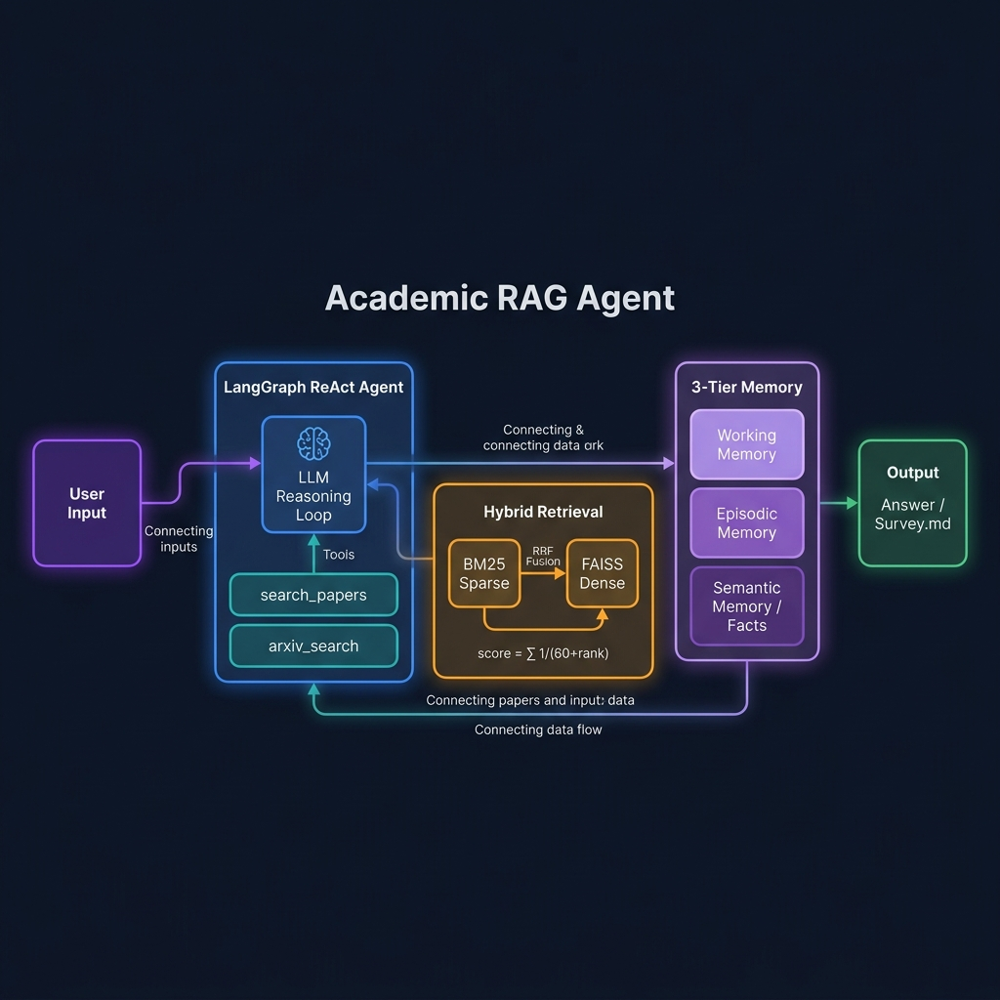
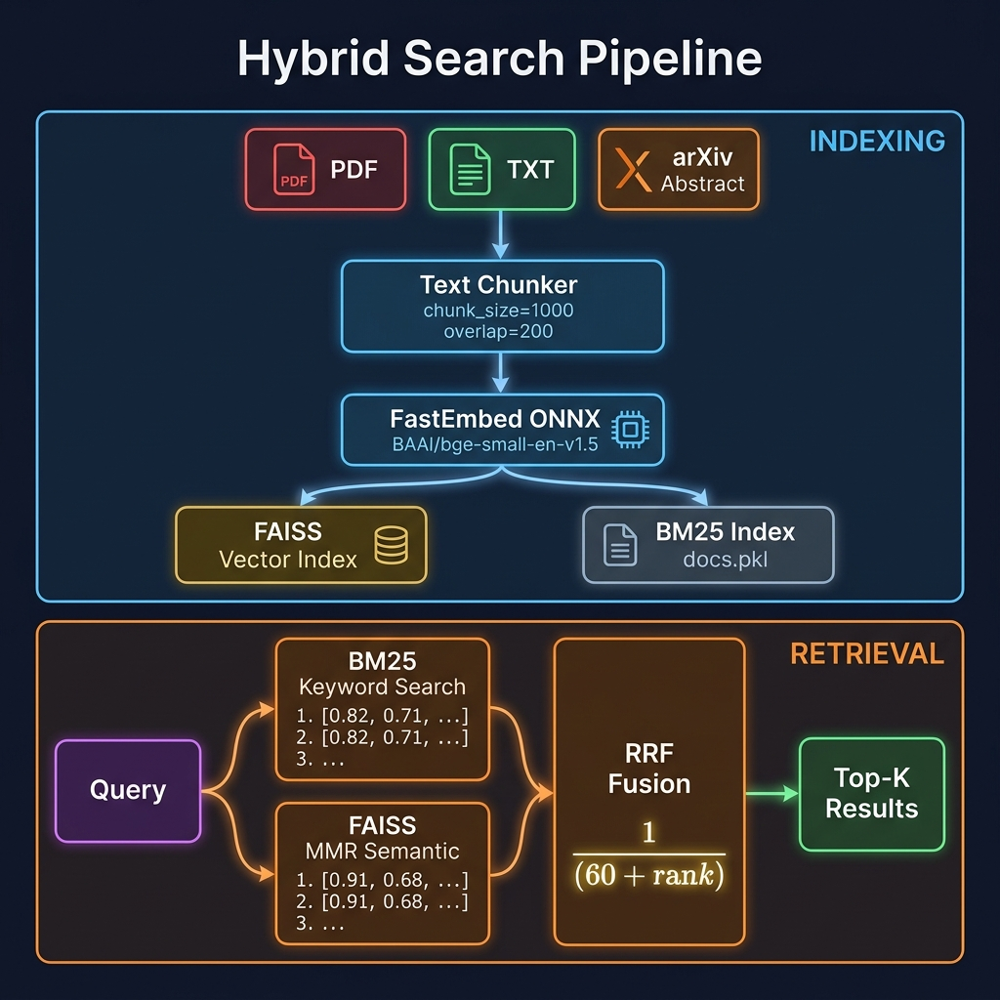
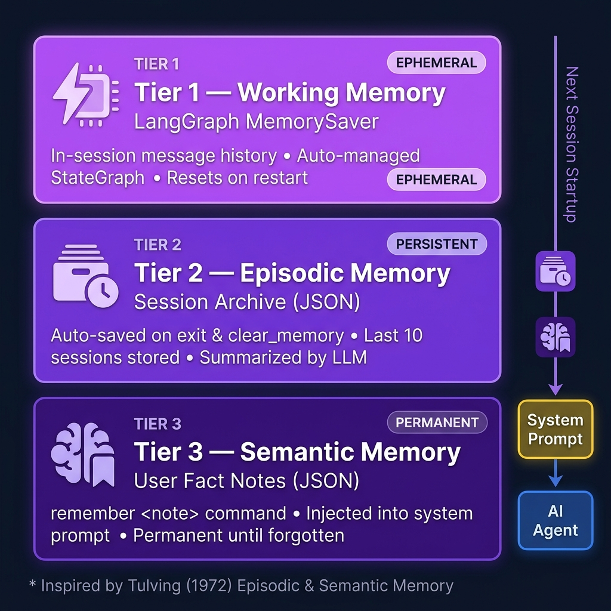
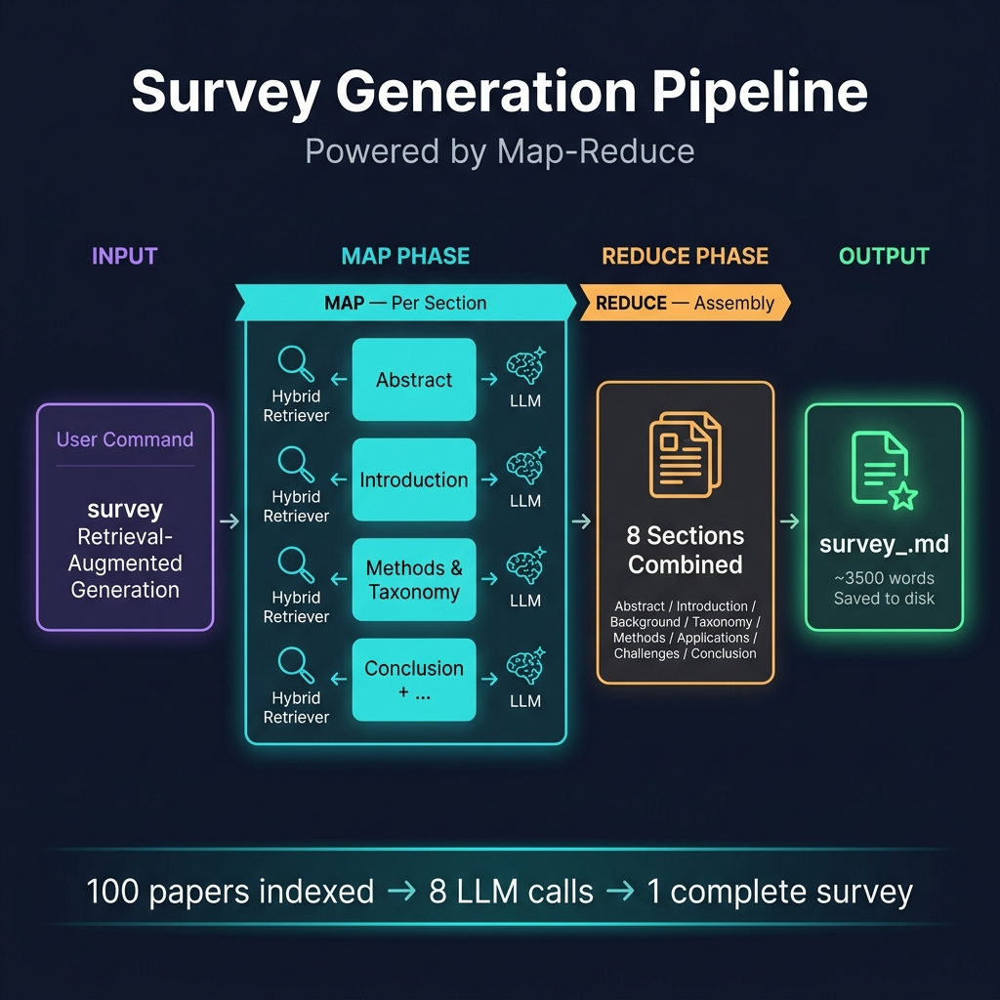

# Academic RAG Agent

<p align="center">
  
  
  
  
  
  
  
</p>

<p align="center">
  <b>A Memory-Augmented LLM Agent for Academic Literature Analysis</b><br>
  面向学术科研文献的记忆增强 LLM Agent — powered by LangGraph &amp; Hybrid RAG
</p>

---

## What It Does

A production-grade AI agent that combines **retrieval-augmented generation**, **hybrid search**, **persistent memory**, and **automated survey writing** into a unified CLI tool for academic research.

```
# Index 100 arXiv papers in seconds
You > bulk_search RAG retrieval augmented generation LLM 100
[✓ 100 papers indexed via BM25 + FAISS hybrid retriever]

# Ask questions grounded in real papers
You > What are the main limitations of current RAG systems?
Agent > Based on indexed papers, the key limitations are: (1) retrieval quality...

# Save important insights to persistent memory
You > remember RRF fusion formula: score = sum(1 / (k + rank_i))
[✓ Saved to memory #1 — persists across restarts]

# Generate a full survey paper automatically
You > survey Retrieval-Augmented Generation for Large Language Models
[Writing 8 sections via Map-Reduce pipeline...]
[✓ Saved: survey_Retrieval-Augmented_Generation_20260417_1800.md]
```

---

## System Architecture



---

## Key Features

| Feature | Implementation | Technical Detail |
|---------|---------------|-----------------|
| **Hybrid Search** | BM25 (sparse) + FAISS MMR (dense) + RRF | Cormack et al., SIGIR 2009 |
| **LangGraph Agent** | `create_react_agent` + `MemorySaver` | Replaces deprecated `AgentExecutor` |
| **FastEmbed** | `BAAI/bge-small-en-v1.5` ONNX Runtime | No PyTorch — ~150MB vs ~1GB |
| **Bulk Indexing** | arXiv API → 100+ paper abstracts | Rate-limited, progress bar |
| **Survey Writer** | Map-Reduce pipeline, 8 sections | RAG-grounded, saves to `.md` |
| **3-Tier Memory** | Working / Episodic / Semantic | Persists across restarts as JSON |
| **Free API** | SiliconFlow Qwen / Groq Llama | Zero cost to start |

---

## Hybrid Search Pipeline



The retrieval system combines two complementary search strategies:

- **BM25 (sparse)** — keyword matching, excellent for technical terms and paper titles
- **FAISS MMR (dense)** — semantic similarity with diversity, handles paraphrasing
- **RRF Fusion** — `score = Σ 1/(60 + rank)` — merges rankings without parameter tuning

---

## Three-Tier Memory System



| Tier | Type | Storage | Lifetime |
|------|------|---------|---------|
| 1 | Working Memory | LangGraph MemorySaver | Session only |
| 2 | Episodic Memory | `memory/memory.json` | Permanent, trimmed to last 10 |
| 3 | Semantic Memory | `memory/memory.json` | Permanent until `forget <id>` |

> Inspired by Tulving (1972) *Episodic & Semantic Memory*, Park et al. (2023) *Generative Agents*

---

## Survey Generation Pipeline



Map-Reduce workflow: for each of the 8 sections, the hybrid retriever finds the most relevant paper chunks, the LLM writes that section using them as grounding context, then all sections are assembled into a final Markdown document.

---

## Quick Start

### 1. Clone & Create Environment

```bash
git clone https://github.com/YOUR_USERNAME/academic-rag-agent.git
cd academic-rag-agent

conda env create -f environment.yml
conda activate rag-agent
```

### 2. Configure API Key

```bash
copy .env.example .env
# Edit .env — fill in OPENAI_API_KEY
```

| Provider | Sign Up | Free Model |
|----------|---------|------------|
| [SiliconFlow](https://cloud.siliconflow.cn) | Phone/Email | `Qwen/Qwen2.5-72B-Instruct` |
| [Groq](https://console.groq.com) | Google account | `llama-3.3-70b-versatile` |

```env
OPENAI_API_KEY=sk-your-key-here
OPENAI_BASE_URL=https://api.siliconflow.cn/v1
OPENAI_MODEL=Qwen/Qwen2.5-72B-Instruct
EMBEDDING_PROVIDER=local
EMBEDDING_MODEL=BAAI/bge-small-en-v1.5
```

### 3. Run

```powershell
conda activate rag-agent
cd path\to\academic-rag-agent
python main.py
```

---

## Command Reference

### Document Commands
| Command | Description |
|---------|-------------|
| `load <path>` | Index a PDF / TXT / MD file |
| `load_dir <dir>` | Index all documents in a folder |

### arXiv Commands
| Command | Description |
|---------|-------------|
| `bulk_search <topic> [N]` | Fetch & index N abstracts from arXiv (default 50) |

```
bulk_search retrieval augmented generation survey 100
```

### Survey Generation
| Command | Description |
|---------|-------------|
| `survey <topic>` | Generate a complete survey paper (Markdown) |
| `survey <topic> --out file.md` | Save to a specific file |

```
bulk_search RAG large language model 80
survey Retrieval-Augmented Generation for LLMs
```

### Memory Commands
| Command | Description |
|---------|-------------|
| `remember <note>` | Save a fact/insight to permanent memory |
| `memories` | Show all saved facts & session archive |
| `forget <id>` | Delete a memory note by ID |
| `clear_memory` | Archive current session and reset chat |

### System Commands
| Command | Description |
|---------|-------------|
| `status` | Show knowledge base & memory stats |
| `clear_db` | Wipe the vector store |
| `help` | Show all commands |
| `exit` | Auto-save session summary and quit |

---

## Project Structure

```
academic-rag-agent/
├── main.py                       # CLI entry point (all commands)
├── requirements.txt
├── environment.yml               # Conda environment
├── .env.example                  # Config template (no secrets)
├── docs/
│   └── images/                   # Architecture diagrams
└── src/
    ├── agent/
    │   └── agent.py              # LangGraph ReAct agent
    ├── rag/
    │   ├── document_loader.py    # PDF/TXT/MD loader with dedup
    │   ├── vector_store.py       # FAISS + FastEmbed + persistence
    │   └── hybrid_retriever.py   # BM25 + FAISS + RRF fusion
    ├── memory/
    │   └── persistent_memory.py  # Three-tier memory system
    └── tools/
        ├── arxiv_tool.py         # arXiv search (LangChain tool)
        ├── bulk_arxiv.py         # Bulk abstract fetcher (100+)
        └── survey_writer.py      # Map-Reduce survey generation
```

---

## Tech References

| Technology | Reference |
|-----------|-----------|
| RAG | Lewis et al., *RAG for Knowledge-Intensive NLP* (NeurIPS 2020) |
| ReAct Agent | Yao et al., *ReAct: Synergizing Reasoning and Acting* (ICLR 2023) |
| RRF Fusion | Cormack, Clarke & Buettcher, *RRF outperforms Condorcet* (SIGIR 2009) |
| MMR Retrieval | Carbonell & Goldstein, *The Use of MMR* (SIGIR 1998) |
| Memory System | Tulving (1972); Park et al., *Generative Agents* (2023) |
| LangGraph | [LangGraph Docs](https://langchain-ai.github.io/langgraph/) |

---

## Roadmap

- [x] Hybrid BM25 + FAISS + RRF retrieval
- [x] LangGraph `create_react_agent` agent
- [x] FastEmbed (ONNX, no PyTorch)
- [x] Bulk arXiv indexing (100+ papers)
- [x] Map-Reduce survey generation
- [x] Three-tier persistent memory
- [ ] Streamlit / Gradio web UI
- [ ] Zotero library integration
- [ ] Multi-agent collaboration (researcher + critic + writer)

---

## License

MIT License
