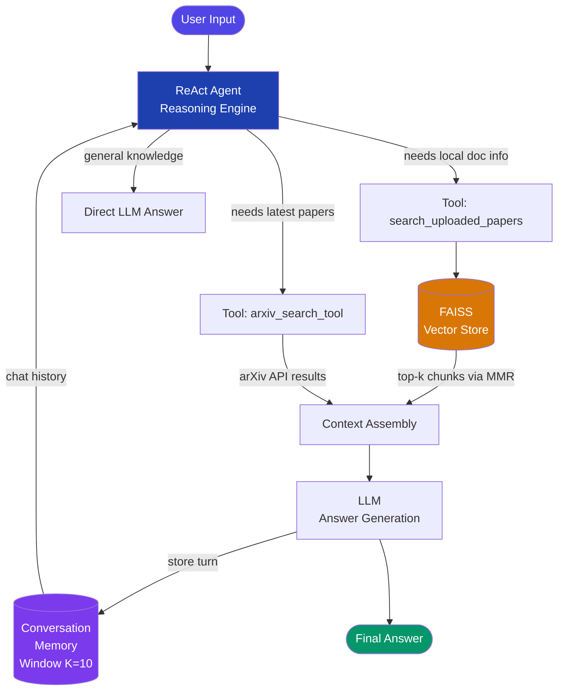
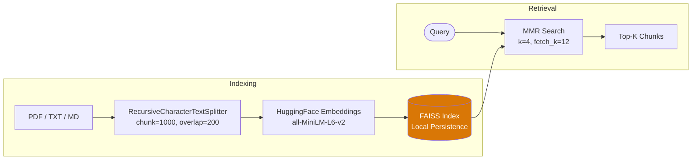

# Academic RAG Agent

<p align="center">
  
  
  
  
  
  
</p>

<p align="center">
  <b>A Memory-Augmented LLM Agent for Academic Literature Analysis</b><br>
  面向学术科研文献的记忆增强 LLM Agent
</p>

---

## What It Does

Upload your research papers, ask questions in natural language, and get answers grounded in your documents — with conversation memory and real-time arXiv search.

```
You > load papers/attention_is_all_you_need.pdf
[47 chunks indexed]

You > What is the role of Multi-Head Attention?

Agent > Based on [attention_is_all_you_need.pdf], Multi-Head Attention allows
        the model to jointly attend to information from different representation
        subspaces at different positions...

You > How does this compare to earlier attention mechanisms?

Agent > (remembers context from previous turn)
        Compared to additive attention used in Bahdanau et al...

You > Search for recent papers on RAG

Agent > Found 5 papers on arXiv:
        [1] A Survey on Retrieval-Augmented Generation...
```

---

## Architecture



---

## Key Features

| Feature | Details |
|---------|---------|
| **RAG** | PDF/TXT/MD loaded, chunked, embedded into FAISS vector store |
| **Memory** | Sliding window keeps last N conversation turns |
| **arXiv Search** | Real-time paper search as an agent tool |
| **ReAct Agent** | Works with any instruction-following LLM, no Function Calling API needed |
| **Local Embeddings** | `all-MiniLM-L6-v2` runs on CPU, fully offline after first download |
| **Free-Friendly** | Compatible with SiliconFlow (free tier) and Groq (free tier) |

---

## Quick Start

### 1. Clone & Install

```bash
git clone https://github.com/YOUR_USERNAME/academic-rag-agent.git
cd academic-rag-agent

# Create isolated conda environment
conda env create -f environment.yml
conda activate rag-agent
```

### 2. Configure API Key

```bash
cp .env.example .env
# Edit .env and fill in your API key
```

**Recommended free options:**

| Provider | Sign Up | Free Model |
|----------|---------|-----------|
| [SiliconFlow](https://cloud.siliconflow.cn) | Phone/Email | `Qwen/Qwen2.5-7B-Instruct` |
| [Groq](https://console.groq.com) | Google account | `llama-3.3-70b-versatile` |

Example `.env` for SiliconFlow:
```env
OPENAI_API_KEY=sk-your-key-here
OPENAI_BASE_URL=https://api.siliconflow.cn/v1
OPENAI_MODEL=Qwen/Qwen2.5-7B-Instruct
EMBEDDING_PROVIDER=local
EMBEDDING_MODEL=all-MiniLM-L6-v2
```

### 3. Run

```bash
# Windows PowerShell
conda activate rag-agent
cd path/to/academic-rag-agent
python main.py
```

---

## Usage

| Command | Description |
|---------|-------------|
| `load <path/to/paper.pdf>` | Index a PDF into the knowledge base |
| `load_dir <path/to/folder>` | Index all documents in a folder |
| `status` | Show knowledge base size and memory usage |
| `clear_memory` | Reset conversation history |
| `clear_db` | Wipe the vector store |
| `help` | Show all commands |
| `exit` | Quit |

---

## RAG Pipeline Detail



---

## Project Structure

```
academic-rag-agent/
├── main.py                    # CLI entry point
├── requirements.txt
├── environment.yml            # Conda environment
├── .env.example               # Config template
├── STARTUP.md                 # Personal startup guide
└── src/
    ├── rag/
    │   ├── document_loader.py # Load & chunk documents
    │   └── vector_store.py    # FAISS management
    ├── agent/
    │   └── agent.py           # ReAct agent core
    └── tools/
        └── arxiv_tool.py      # arXiv search tool
```

---

## Tech References

- **RAG**: Lewis et al., *Retrieval-Augmented Generation for Knowledge-Intensive NLP Tasks* (NeurIPS 2020)
- **ReAct**: Yao et al., *ReAct: Synergizing Reasoning and Acting in Language Models* (ICLR 2023)
- **MMR**: Carbonell & Goldstein, *The Use of MMR, Diversity-Based Reranking for Reordering Documents* (SIGIR 1998)

---

## Roadmap

- [ ] Gradio / Streamlit web UI
- [ ] Multi-modal support (figures, equations)
- [ ] Zotero library integration
- [ ] Literature review draft generation
- [ ] Multi-agent collaboration

---

## License

MIT License
